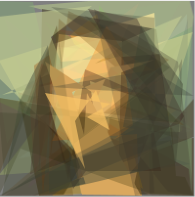

# Лабораторная работа №2

**Дисциплина:** "Эволюционные вычисления"

**Дата:** 22/02/2023

**Выполнил:** Федоров Сергей, M4150 

**Название:** "Введение в Эволюционные вычисления"

**Вариант:**

## Описания выполнения:

1. Скачать репозиторий с исходным кодом фреймворка [watchmaker](https://github.com/dwdyer/watchmaker)
2. Настроить среду исполнения для запуска проекта
3. Эксперименты с `bits count`
4. Эксперименты с `traveling salesman`
5. Эксперименты с `mona lisa`
6. Ответы на поставленные вопросы

### Скачивание репозитория

Для скачивания репозитория используется команда `git clone` с указанием ссылки на репозиторий.

```bash
git clone add https://github.com/dwdyer/watchmaker.git
```

Однако так как исходный код лабораторных также хранится в репозитории, предпочтительнее использовать команду `git submodule` для скачивания репозитория.

```bash
git submodule add https://github.com/dwdyer/watchmaker.git Lab_2/watchmaker
```

### Настройка среды исполнения

На этом этапе не стоит заострять внимание, так как этот процесс детально описан в предоставленной методичке. Однако, стоит отметить что в моем случае были проблемы с использованием графического интерфейса генерируемым Swing. Поэтому пришлось, после тщетных попыток найти причину, перебрать несколько разных версий JDK 1.8.0_181. И даже так, на моей ОС периодически возникала следующая ошибка (которая прекращала работу программы):

```
2022-02-23 22:53:36.235 java[14612:234712] +[AWTView keyboardInputSourceChanged:]: unrecognized selector sent to class 0x1280013e0
2022-02-23 22:53:36.243 java[14612:234712] *** Terminating app due to uncaught exception 'NSInvalidArgumentException', reason: '+[AWTView keyboardInputSourceChanged:]: unrecognized selector sent to class 0x1280013e0'
*** First throw call stack:
(
	0   CoreFoundation                      0x00007ff81aeec3eb __exceptionPreprocess + 242
	1   libobjc.A.dylib                     0x00007ff81aa38e25 objc_exception_throw + 48
	2   CoreFoundation                      0x00007ff81af83483 __CFExceptionProem + 0
	3   CoreFoundation                      0x00007ff81ae5662b _forwarding_ + 1324
	4   CoreFoundation                      0x00007ff81ae56068 _CF_forwarding_prep_0 + 120
	5   CoreFoundation                      0x00007ff81ae693d4 CFNOTIFICATIONCENTER_IS_CALLING_OUT_TO_AN_OBSERVER + 137
	6   CoreFoundation                      0x00007ff81af0341a ___CFXRegistrationPost_block_invoke + 88
	7   CoreFoundation                      0x00007ff81af03369 _CFXRegistrationPost + 536
	8   CoreFoundation                      0x00007ff81ae3c8f9 _CFXNotificationPost + 735
	9   Foundation                          0x00007ff81bc78abc -[NSNotificationCenter postNotificationName:object:userInfo:] + 82
	10  AppKit                              0x00007ff81e3279ac __NSSelectedKeyboardInputSourcesChangedNotification + 58
    ... 
    37  libjli.dylib                        0x0000000101976787 JLI_Launch + 1315
	38  java                                0x00000001018d1b6f main + 367
	39  dyld                                0x00007ff81aa65310 start + 2432
)
```

Из-за данной проблемы время выполнении лабораторной работы выросло непорпорционально ее сложности.

### Bits Count

В данном эксперименте целью алгоритма является максимизация количества единиц в битовой строке. Путем периодических применений операций кроссинговера и мутации над популяцией битовых строк, алгоритм должен сойтись на решении, состоящем только из единиц. Было замерено сколько поколений популяций может потребоваться данному алгоритму для нахождения строки из единиц длиной 20, 50 и 100. Результаты представлены в таблице ниже.

| Bits DIM | Run 1     | Run 2      | Run 3     | Run 4   | Run 5     | Average   |
| :------- | :-------- | :--------- | :-------- | :------ | :-------- | :-------- |
| 20       | 27        | 18         | 23        | 21      | 22        | 22        |
| 50       | 805       | 1,461      | 2,061     | 1,540   | 2,923     | 1,758     |
| 100      | 5,900,453 | 13,012,529 | 5,024,218 | 704,338 | 6,688,191 | 6,265,946 |

### Traveling salesman

В данном эксперименте целью алгоритма является минимазация длинны пути через заданный список обязательных для посещения городов. Были замерены результаты прогонов для различных исходных параметров алгоритма. Результаты представлены в таблице ниже.

| Популяция | Элитизм | Кол-во поколений | Стратегия селекции | Расстояние | Затраченное время |
| :-------- | :------ | :--------------- | :----------------- | :--------- | :---------------- |
| 300       | 3       | 100              | Truncation 50      | 10494      | 0.091             |
| 3000      | 3       | 100              | Truncation 50      | 10494      | 0.87              |
| 100       | 3       | 100              | Truncation 50      | 11313      | 0.024             |
| 3000      | 3       | 100              | Truncation 50      | 10494      | 0.87              |
| 10        | 3       | 100              | Truncation 50      | 11225      | 0.005             |
| 10        | 3       | 10000            | Truncation 50      | 11578      | 0.364             |
| 10        | 3       | 10               | Truncation 50      | 15751      | 0.001             |
| 10        | 3       | 10000            | Truncation 50      | 11296      | 0.348             |
| 10000     | 3       | 10000            | Truncation 50      | 10494      | 185.16            |

### Mona Lisa

В данном эксперименте целью алгоритма является реконструкция изображения используя полигоны и минимазция разницы между оригинальным и реконструированным изображением. Было сделано предположение что изначально заданные параметры сильно влияют на скорость сходимости алгоритма, потому во всех случаях результаты фиксировались на отметке в 20 тысяч поколений. Результаты представлены в таблице ниже.

| Субъективный результат | Кол-во поколений | Значение фитнес-функции | Кол-во полигонов | Кол-во углов | Решение                                       |
| :--------------------- | :--------------- | :---------------------- | :--------------- | :----------- | :-------------------------------------------- |
| плохой                 | 20049            | 240708                  | 30               | 248          |      |
| нормальный             | 20091            | 224782                  | 28               | 218          |  |
| Хороший                | 21009            | 210844                  | 36               | 277          |      |

### Ответы на вопросы

1. *К какому типу по структуре решений относится каждая из рассмотренных задач?*

        1.Bits Counts — векторный

        2.Traveling Salesman — комбинаторный

        3.Mona Lisa — комбинаторный


2. *Как закодированы решения в задаче коммивояжёра?*

        В качестве списка городов в порядке из посещения.


3. *Что является генотипом, а что фенотипом в задаче воспроизведения картины?*

        * Генотипом является — множество полигонов описывающих картину

        * Фенотип — сгенерированное по полигонам изображение
