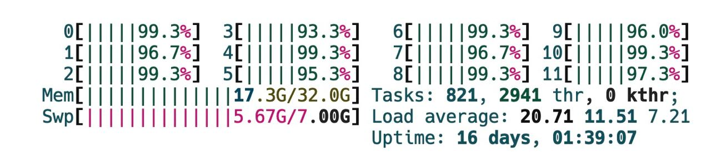

# Лабораторная работа №3

**Дисциплина:** "Эволюционные вычисления"

**Дата:** 11/03/2023

**Выполнил:** Федоров Сергей, M4150 

**Название:** "Генетический алгоритм для задачи оптимизации непрерывной функции"

**Репозиторий с исходным кодом:** [Репозиторий](https://github.com/Punctuality/Evolutionary_Algorithm_ITMO_2023)

## Описания выполнения:

1. Скачать репозиторий с исходным кодом заглушек проекта: [Репозиторий](https://gitlab.com/itmo_ec_labs/lab2)
2. Настроить среду исполнения для запуска проекта
3. Имплементация инициализации популяции
4. Имплементация операции кроссинговера
5. Имплементация операции мутации
6. Имплементация модуля прогона по сетке
7. Поиск оптимальных параметров алгоритма
8. Итоговые результаты работы алгоритма
9. Ответы на поставленные вопросы

### Скачивание репозитория

Для скачивания репозитория используется команда `git submodule add` для скачивания репозитория.

```bash
git submodule add https://gitlab.com/Punctuality/evolutionary-algorithm-itmo-2023-lab-3 Lab_3/code
```

Стоит так-же сказать что из-за того что репозиторий находится в GitLab, GitHub репозиторий, где хранится вся информация о лабораторной работе, не дает возможности по щелчку на ссылку перейти в репозиторий. Поэтому стоит использовать ссылку указанную выше в команда добавления подмодуля.

###  Имплементация инициализации популяции 
#### MyFactory

Помимо параметра размерности популяции я также передаю максимальные и минимальные значения вещественных чисел в популяции, чтобы при инициализации популяции использовать их в качестве границ для генерации. Затем каждое значение генерируется предоставленным генератором случайных чисел.

```java
public double[] generateRandomCandidate(Random random) {
    double[] solution = new double[this.dimension];

    for (int idx = 0; idx < this.dimension; idx++)
        solution[idx] = RandomUtils.randomDoubleInRange(this.minBound, this.maxBound, random);

    return solution;
}
```

Основные функции для работы со случайными числами предоставлены ниже:

```java
public static double randomDoubleWithOffset(double offset, Random random) {
    return randomDoubleInRange(-offset, offset, random);
}

public static double randomDoubleInRange(double minBound, double maxBound, Random random) {
    return random.nextDouble() * (maxBound - minBound) + minBound;
}

public static double keepInRange(double minBound, double maxBound, double value) {
    return Math.max(minBound, Math.min(maxBound, value));
}
```

###  Имплементация операции кроссинговера
#### MyCrossover

В операции кроссинговера я выбираю случайным образом N точек, где N это переданный параметр количества точек для кроссинговера. Затем в данных точках происходит обмен значениями между двумя родительскими кандитатами. После этого возвращается список из двух дочерних кандидатов.

```java
private void swapElement(double[] a1, double[] a2, int idx) {
    double tmp = a1[idx];
    a1[idx] = a2[idx];
    a2[idx] = tmp;
}

protected List<double[]> mate(double[] p1, double[] p2, int numberOfCrossoverPoints, Random random) {
    if (p1.length != p2.length)
        throw new IllegalStateException("Input candidates cannot have different dimensions on crossover");

    ArrayList<double[]> crossOver = new ArrayList<>(2);;
    if (isImmutable) {
        crossOver.add(p1.clone());
        crossOver.add(p2.clone());
    } else {
        crossOver.add(p1);
        crossOver.add(p2);
    }
    for (int i = 0; i < numberOfCrossoverPoints; i++) {
        int swapPoint = random.nextInt(p1.length);
        swapElement(crossOver.get(0), crossOver.get(1), swapPoint);
    }

    return crossOver;
```

Стоит отметить что присутствует возможность выполнять данную операцию с изменением родительских массивов или клонировать их и тем самым не изменять исходные данные. Это было сделано от того что я изначально не имел представления о том как работает фреймворк внутри и в отличие от `EvolutionaryOperator` в документации не было четкого указания на то что операция кроссинговера не должна изменять исходные данные. Как оказалось иммутабельность в данном случае необходима для корректной работы алгоритма. 

###  Имплементация операции мутации
#### MyMutation

В операции мутации, в документации изначально было сказано что родительские кандидаты не должны изменяться, поэтому на каждом этапе мутации происходит клонирование массива. Затем по заданной вероятности мутации каждого отдельного элемента происходит изменение значения со случайным смещением в пределах указанного. После этого значение проверяется на принадлежность к заданным границам и если оно выходит за границы, то оно приводится к границе.

```java
private double[] mutate(double[] candidate, Random random) {
    if (isImmutable)
        candidate = candidate.clone();

    for (int i = 0; i < candidate.length; i++) {
        if (random.nextDouble() <= changeProb) {
            candidate[i] += RandomUtils.randomDoubleWithOffset(this.maxDiff, random);
            candidate[i] = RandomUtils.keepInRange(this.minBound, this.maxBound, candidate[i]);
        }
    }

    return candidate;
}


public List<double[]> apply(List<double[]> population, Random random) {
    ArrayList<double[]> mutated = new ArrayList<>(population.size());

    for (double[] candidate : population) {
        mutated.add(mutate(candidate, random));
    }

    return mutated;
}
```

### Имплементация модуля прогона по сетке
#### GridEvaluator, ExperimentUnit, ExperimentResult

Для более удобного поиска оптимальных гиперпаратметров алгоритма был реализован некий аналог GridSearch из sklearn. Для этого были реализованы классы `GridEvaluator`, `ExperimentUnit`, `ExperimentResult`. В классе GridEvaluator реализована логика прогона по сетке. В классе ExperimentUnit хранятся параметры и описания алгоритма для выполнения эксперимента. В классе ExperimentResult хранится результат одного прогона.

В классе `ExperimentResult` хранится лучший результат (`bestResult`), лучший кандидат (`bestCandidate`), номер итерации на которой был достигнут лучший результат (`firstAchievedIter`) и время выполнения эксперимента (`evalTime`). Для сравнения результатов был переопределен метод `compareTo`.

```java
public record ExperimentResult(double bestResult, double[] bestCandidate, int firstAchievedIter, long evalTime) implements Comparable<ExperimentResult> {
    @Override
    public int compareTo(ExperimentResult that) {
        return Objects.compare(this, that,
                Comparator.comparing(ExperimentResult::bestResult)
                        .thenComparing(ExperimentResult::firstAchievedIter)
                        .thenComparing(ExperimentResult::evalTime)
        );
    }
}
```

В классе `ExpetimentUnit` хранятся параметры и описания алгоритма для выполнения эксперимента. Каждый прогон инициализируется как `RecursiveTask` для грамотного распределение ресурсов при выполнении на пуле потоков. Те представители классов фреймворка что можно инициализровать лишь единожды для всех прогонов и конфигураций - не создаются множество раз. В методе `compute` все подзадачи вызываются одновременно и результаты собираются в список.

```java
RecursiveTask<ExperimentResult> setUpTask(
        CandidateFactory<double[]> factory,
        EvolutionPipeline<double[]> pipeline,
        SelectionStrategy<Object> selection,
        Random random
) {
    final FitnessEvaluator<double[]> evaluator = new FitnessFunction(dimension);

    final EvolutionEngine<double[]> algorithm = new SteadyStateEvolutionEngine<>(
            factory,
            pipeline,
            evaluator,
            selection,
            populationSize,
            false,
            random
    );

    return new RecursiveTask<>() {
        @Override
        protected ExperimentResult compute() {

            AtomicReference<Double> bestFit = new AtomicReference<>(Double.MIN_VALUE);
            AtomicInteger firstAchievedIter = new AtomicInteger(0);

            algorithm.addEvolutionObserver(populationData -> {

                double currentFit = populationData.getBestCandidateFitness();

                if (bestFit.get() < currentFit) {
                    bestFit.set(currentFit);
                    firstAchievedIter.set(populationData.getGenerationNumber());
                }
            });

            TerminationCondition terminate = new GenerationCount(generations);

            long startTime = System.currentTimeMillis();
            double[] bestCandidate = algorithm.evolve(populationSize, 1, terminate);
            long endTime = System.currentTimeMillis();

            return new ExperimentResult(bestFit.get(), bestCandidate, firstAchievedIter.get(), endTime - startTime);
        }
    };
}


@Override
protected ExperimentResult[] compute() {
    CandidateFactory<double[]> factory = new MyFactory(dimension, -5, 5);

    ArrayList<EvolutionaryOperator<double[]>> operators = new ArrayList<>();
    operators.add(new MyCrossover(true));
    operators.add(new MyMutation(-5, 5, this.maxMutationDiff, this.mutationProb, true));
    EvolutionPipeline<double[]> pipeline = new EvolutionPipeline<>(operators);

    SelectionStrategy<Object> selection = new RouletteWheelSelection();

    ArrayList<RecursiveTask<ExperimentResult>> tasks = new ArrayList<>(this.randoms.length);

    for (Random random : this.randoms) {
        tasks.add(setUpTask(factory, pipeline, selection, random));
    }

    System.out.printf("Running experiment [dim: %d, populationSize: %d, generations: %d, maxDiff: %.2f, mutationProb: %.2f, repeats: %d]\n",
            this.dimension, this.populationSize, this.generations, this.maxMutationDiff, this.mutationProb, this.randoms.length);
    return ForkJoinTask.invokeAll(tasks).stream().map(ForkJoinTask::join).toArray(ExperimentResult[]::new);
}
```

В классе `GridEvaluator` используется `ForkJoinPool` для параллельного выполнения задач. Каждая задача представляет собой полный эксперимент (с повторным прогонами, которые в свою очередь также являются `RecursiveTask`) алгоритма с определенными параметрами. Все задачи генерируются в методе produceTasks. В методе `compute` происходит выполнение задач и запись результатов в файл. Тут стоит также заметить что используется механизм дженериков и можно использовать различные определения задачи и результатов.

```java
List<Pair<List<?>, E>> produceTasks() {
    return Lists.cartesianProduct(this.variables).stream().map(input -> {
        E task = this.compiler.apply(input);
        return new Pair<List<?>, E>(input, task);
    }).toList();
}

@Override
protected void compute() {
    try {
        FileOutputStream fos = new FileOutputStream(this.outputFile);
        PrintWriter p = new PrintWriter(fos);

        List<String> allNames = new ArrayList<>(paramNames);
        allNames.addAll(resultNames);


        List<Pair<List<?>, E>> tasks = produceTasks();
        System.out.printf("Total number of configs to run: %d (doesn't account for repeats)\n", tasks.size());

        p.println(allNames.stream().reduce((s, s2) -> s + "," + s2).get());
        tasks
            .stream()
            .peek(paramsAndTask -> paramsAndTask.getValue1().fork())
            .map(paramsAndTask -> {
                List<String> paramElems = paramsAndTask.getValue0().stream().map(Object::toString).toList();
                R result = paramsAndTask.getValue1().join();
                return new Pair<>(result, paramElems);
            })
            .map(result -> {
                List<String> allRowElems = new ArrayList<>(result.getValue1());
                allRowElems.addAll(this.rowLogger.apply(result.getValue0()));
                return allRowElems.stream().reduce((s, s2) -> s + "," + s2).get();
            }).forEachOrdered(p::println);

        p.flush();
        p.close();
    } catch (FileNotFoundException e) {
        throw new RuntimeException("File Not Found");
    }
}
```

Стоит заметить что такой подход к написанию данного модуля позволил достаточно эффективно утилизировать ресурсы и значительно ускорить процесс выполнения экспериментов.



### Поиск оптимальных параметров алгоритма

Поскольку первоначальные прогоны не давали удволетворительных результатов было принято решение провести поиск оптимальных параметров алгоритма. Для этого был написан класс `GridEvaluator` который позволяет задать набор параметров и для каждого из них запустить заданное количество экспериментов. 

Изначально был проведен поиск по наиболее общирному разбросу параметров. Результаты храняться в файле `wide_search.csv`. Было выявлено что при увелечении размерности значение гиперпараметров максимального отклонения в мутации и ее вероятности - сильно вляет на результат.

Поэтому далее была выполнена серия прогонов для нахождения оптимальных значений этих гиперпараметров при максимальном значении размерности и кол-ва поколений рассматриваемых в данной лабораторной работе. Результаты храняться в файлах `mutation_search(1/2/3).csv`. По итогу было выявлено, что в данном случае оптимальными являются значения гиперпараметров: `maxMutationDiff = 1.4`, `mutationProb = 0.01`.

В конце концов был выполнен прогон по необходимым комбинациям параметров указанных в описании лабораторной работы (Таблица №2.1 из условия) с использованием найденных оптимальных значений гиперпараметров. Результаты храняться в файле `final_results.csv` и указаны ниже.

### Итоговые результаты работы алгоритма

| Max mutation diff | Mutation Prob | Dimension | Population Size | Generations | Repeats | Best fitness       | First generation of best | Mean time (ms) |
| :---------------- | :------------ | :-------- | :-------------- | :---------- | :------ | :----------------- | :----------------------- | :------------- |
| 1.4               | 0.01          | 2         | 10              | 100         | 10      | 7.169224599175752  | 97                       | 45.9           |
| 1.4               | 0.01          | 2         | 10              | 500         | 10      | 8.356695334339614  | 339                      | 62.5           |
| 1.4               | 0.01          | 2         | 10              | 1000        | 10      | 9.83763898431589   | 791                      | 77.8           |
| 1.4               | 0.01          | 2         | 10              | 10000       | 10      | 9.983519583660637  | 9765                     | 673.1          |
| 1.4               | 0.01          | 2         | 50              | 100         | 10      | 9.578004735321713  | 44                       | 28.0           |
| 1.4               | 0.01          | 2         | 50              | 500         | 10      | 9.932739049409516  | 403                      | 133.4          |
| 1.4               | 0.01          | 2         | 50              | 1000        | 10      | 9.978676579832017  | 935                      | 228.3          |
| 1.4               | 0.01          | 2         | 50              | 10000       | 10      | 9.996886400798136  | 7568                     | 2262.5         |
| 1.4               | 0.01          | 2         | 100             | 100         | 10      | 9.752169488382334  | 19                       | 43.0           |
| 1.4               | 0.01          | 2         | 100             | 500         | 10      | 9.920594941075105  | 332                      | 218.9          |
| 1.4               | 0.01          | 2         | 100             | 1000        | 10      | 9.980545655519416  | 947                      | 456.7          |
| 1.4               | 0.01          | 2         | 100             | 10000       | 10      | 9.998936291492232  | 9737                     | 4714.2         |
| 1.4               | 0.01          | 5         | 10              | 100         | 10      | 6.400995828080546  | 62                       | 7.0            |
| 1.4               | 0.01          | 5         | 10              | 500         | 10      | 8.149857980215833  | 405                      | 32.9           |
| 1.4               | 0.01          | 5         | 10              | 1000        | 10      | 9.7508920817045    | 913                      | 63.3           |
| 1.4               | 0.01          | 5         | 10              | 10000       | 10      | 9.989940373005263  | 9669                     | 660.1          |
| 1.4               | 0.01          | 5         | 50              | 100         | 10      | 8.192781537338384  | 99                       | 28.0           |
| 1.4               | 0.01          | 5         | 50              | 500         | 10      | 9.700775499477473  | 444                      | 141.0          |
| 1.4               | 0.01          | 5         | 50              | 1000        | 10      | 9.95619876077559   | 846                      | 286.0          |
| 1.4               | 0.01          | 5         | 50              | 10000       | 10      | 9.997687176548952  | 8383                     | 2924.1         |
| 1.4               | 0.01          | 5         | 100             | 100         | 10      | 8.741871403343257  | 94                       | 55.6           |
| 1.4               | 0.01          | 5         | 100             | 500         | 10      | 9.91626675464683   | 477                      | 287.3          |
| 1.4               | 0.01          | 5         | 100             | 1000        | 10      | 9.967694650909484  | 852                      | 571.0          |
| 1.4               | 0.01          | 5         | 100             | 10000       | 10      | 9.998213267914146  | 9406                     | 5899.4         |
| 1.4               | 0.01          | 10        | 10              | 100         | 10      | 4.862437739816979  | 89                       | 7.0            |
| 1.4               | 0.01          | 10        | 10              | 500         | 10      | 8.129475196678792  | 477                      | 37.0           |
| 1.4               | 0.01          | 10        | 10              | 1000        | 10      | 9.559816747682508  | 993                      | 74.3           |
| 1.4               | 0.01          | 10        | 10              | 10000       | 10      | 9.982456912548345  | 8059                     | 754.1          |
| 1.4               | 0.01          | 10        | 50              | 100         | 10      | 7.226810485744133  | 99                       | 32.5           |
| 1.4               | 0.01          | 10        | 50              | 500         | 10      | 9.641475020557547  | 430                      | 162.5          |
| 1.4               | 0.01          | 10        | 50              | 1000        | 10      | 9.846332241380493  | 979                      | 339.7          |
| 1.4               | 0.01          | 10        | 50              | 10000       | 10      | 9.994900837720532  | 9833                     | 3291.4         |
| 1.4               | 0.01          | 10        | 100             | 100         | 10      | 7.714589602401267  | 86                       | 62.0           |
| 1.4               | 0.01          | 10        | 100             | 500         | 10      | 9.481034941643415  | 462                      | 315.6          |
| 1.4               | 0.01          | 10        | 100             | 1000        | 10      | 9.880455152653346  | 923                      | 628.4          |
| 1.4               | 0.01          | 10        | 100             | 10000       | 10      | 9.99554497311493   | 8039                     | 6509.2         |
| 1.4               | 0.01          | 20        | 10              | 100         | 10      | 5.264892929383075  | 95                       | 8.2            |
| 1.4               | 0.01          | 20        | 10              | 500         | 10      | 6.984464639010707  | 487                      | 40.9           |
| 1.4               | 0.01          | 20        | 10              | 1000        | 10      | 8.568189575544753  | 987                      | 83.6           |
| 1.4               | 0.01          | 20        | 10              | 10000       | 10      | 9.968398718065945  | 9750                     | 842.6          |
| 1.4               | 0.01          | 20        | 50              | 100         | 10      | 5.604172806609418  | 98                       | 37.0           |
| 1.4               | 0.01          | 20        | 50              | 500         | 10      | 7.560059943614846  | 495                      | 189.0          |
| 1.4               | 0.01          | 20        | 50              | 1000        | 10      | 9.277396004850205  | 983                      | 381.9          |
| 1.4               | 0.01          | 20        | 50              | 10000       | 10      | 9.98414030664023   | 9663                     | 3794.9         |
| 1.4               | 0.01          | 20        | 100             | 100         | 10      | 6.929115658860418  | 96                       | 71.5           |
| 1.4               | 0.01          | 20        | 100             | 500         | 10      | 8.446024100217727  | 490                      | 374.9          |
| 1.4               | 0.01          | 20        | 100             | 1000        | 10      | 9.467330351026988  | 946                      | 740.2          |
| 1.4               | 0.01          | 20        | 100             | 10000       | 10      | 9.984669216891088  | 9851                     | 7772.0         |
| 1.4               | 0.01          | 50        | 10              | 100         | 10      | 4.672372490421049  | 97                       | 11.1           |
| 1.4               | 0.01          | 50        | 10              | 500         | 10      | 5.829775422612467  | 491                      | 52.9           |
| 1.4               | 0.01          | 50        | 10              | 1000        | 10      | 6.770951534879956  | 969                      | 105.0          |
| 1.4               | 0.01          | 50        | 10              | 10000       | 10      | 9.891957337461804  | 9776                     | 1037.6         |
| 1.4               | 0.01          | 50        | 50              | 100         | 10      | 4.929327314576176  | 95                       | 49.9           |
| 1.4               | 0.01          | 50        | 50              | 500         | 10      | 6.240562167358835  | 483                      | 253.3          |
| 1.4               | 0.01          | 50        | 50              | 1000        | 10      | 7.108202661058531  | 983                      | 495.5          |
| 1.4               | 0.01          | 50        | 50              | 10000       | 10      | 9.937939360120112  | 9509                     | 4899.4         |
| 1.4               | 0.01          | 50        | 100             | 100         | 10      | 5.377868117182601  | 97                       | 93.7           |
| 1.4               | 0.01          | 50        | 100             | 500         | 10      | 6.988768611350713  | 485                      | 472.7          |
| 1.4               | 0.01          | 50        | 100             | 1000        | 10      | 7.935450852851943  | 969                      | 932.2          |
| 1.4               | 0.01          | 50        | 100             | 10000       | 10      | 9.935292144983737  | 9748                     | 9731.5         |
| 1.4               | 0.01          | 100       | 10              | 100         | 10      | 4.3467504562690475 | 94                       | 13.9           |
| 1.4               | 0.01          | 100       | 10              | 500         | 10      | 5.358974662175237  | 493                      | 71.3           |
| 1.4               | 0.01          | 100       | 10              | 1000        | 10      | 6.185880209049687  | 993                      | 148.9          |
| 1.4               | 0.01          | 100       | 10              | 10000       | 10      | 9.633803191676295  | 9969                     | 1505.3         |
| 1.4               | 0.01          | 100       | 50              | 100         | 10      | 4.722807225337082  | 98                       | 63.0           |
| 1.4               | 0.01          | 100       | 50              | 500         | 10      | 5.782021277181583  | 492                      | 293.0          |
| 1.4               | 0.01          | 100       | 50              | 1000        | 10      | 6.434661447592964  | 997                      | 655.2          |
| 1.4               | 0.01          | 100       | 50              | 10000       | 10      | 9.727942527873294  | 9825                     | 6818.1         |
| 1.4               | 0.01          | 100       | 100             | 100         | 10      | 4.774430220429322  | 95                       | 144.1          |
| 1.4               | 0.01          | 100       | 100             | 500         | 10      | 5.828382341733764  | 492                      | 609.5          |
| 1.4               | 0.01          | 100       | 100             | 1000        | 10      | 6.312689359638096  | 991                      | 1391.9         |
| 1.4               | 0.01          | 100       | 100             | 10000       | 10      | 9.73784274953746   | 9973                     | 12915.7        |
|                   |               |           |                 |             |         |                    |                          |                |

Из интересных наблюдений стоит отметить:
1. Время работы алгоритма растёт не только от кол-ва поколений, но также и от размерности кандидатов, однако, как кажется не в линейной зависимости. 
2. Удовлетворительные результаты чаще всего достигаются при высоких значениях кол-ва поколений.
3. Одним из признаков того что оптимимальные гиперпараметры были найдены - лучший результат часто был найден незадолго до достижения максимального кол-ва поколений, что указывает что данный алгоритм работает лучше, чем какой-нибудь условный случайный поиск (и лучше чем при плохих гиперпараметрах).
4. По всем комбинацием параметров удалось достичь удволетворительных показателей фитнес функции (больше 9.5) в конечном счете.

### Ответы на вопросы

1. *Что важнее кроссовер или мутация?*

Выглядит так что, в данной задаче оператор мутации больше влиял на итоговый результат чем оператор кроссовера.

2. *Как влияет размер параметра "размер популяции" на производительность и эффективность алгоритма?*

Увеличенный размер популяции линейно влияет на затрачиваемое время работы алгоритма, однако незначительно влияет на эффективность нахождения оптимального результата. Для примера, при размерности задачи 100 и кол-ве поколений 10000 разница в результатах между популяциями 10 и 100 была всего 0.1 (и оба были удволетворительными), тогда как время выполнения было меньше в 8.6 раз.

3. *Важно ли знать область определение переменных целевой функции?*

И да и нет. В данной задаче нам было указано что значения должны находится в диапазоне от -5 до 5, чтобы гарантировать валидность работы фитнес-функции, а так же это может позволить оптимизировать работу оператора мутации, чтобы отметать невалидные изменения. Однако, в целом, это не является обязательным условием, так как алгоритм рассматривает фитнес-функцию как некоторый black-box это не должно влиять на возможность алгоритма сойтись к оптимуму в конечном счете.